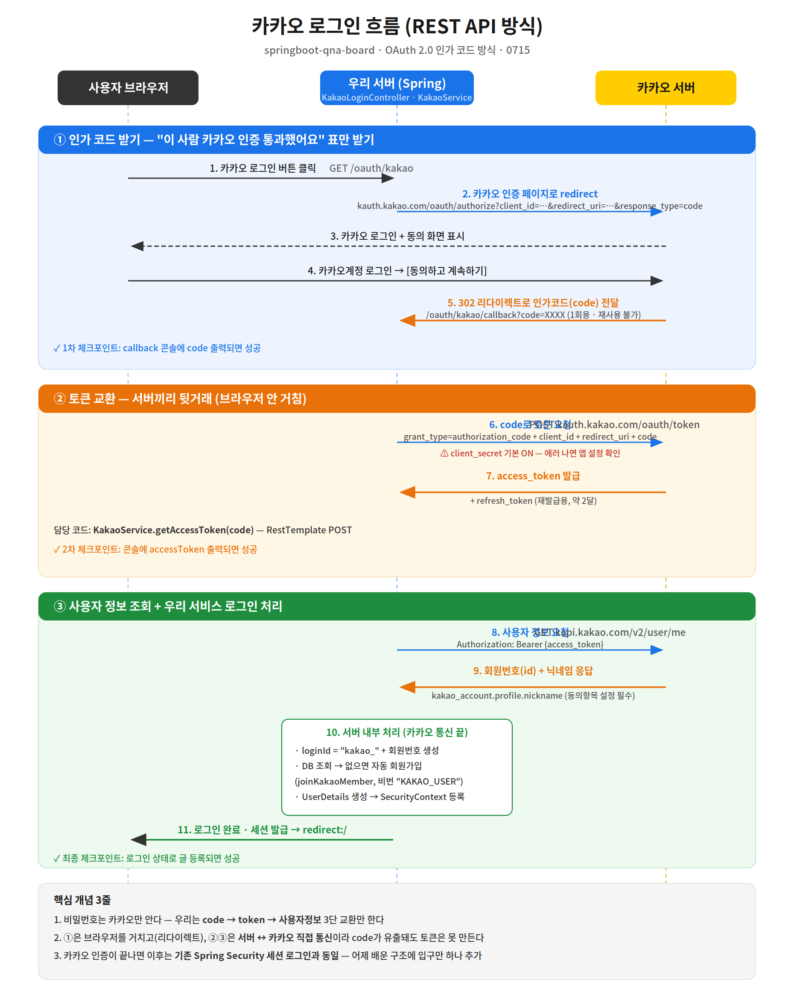

# springboot-qna-board

**Spring Boot 기반 Q&A 게시판 — 회원·인증·게시판·검색·권한을 밑바닥부터 구현하고, Spring Security와 OAuth2 소셜 로그인(카카오·구글)까지 확장**


> **Documentation verified against commit:** `cc98f78`

<!-- IMG: 대표스크린샷(질문목록+검색).png | 질문 목록 · 검색 · 페이징 -->

---

## 📌 3줄 요약

- **What** — 회원가입·로그인부터 질문/답변 CRUD, 검색, 페이징, 관리자 노출 제어까지 갖춘 서버사이드 렌더링 Q&A 게시판.
- **Why** — KDT 과정에서 프레임워크의 "마법"에 기대지 않고, 인증과 CRUD가 실제로 어떻게 동작하는지 원리를 직접 구현하며 학습하기 위해 만들었습니다. 인증은 **세션 기반으로 직접 구현한 뒤 Spring Security로 전환**해, 두 시점을 태그로 남겼습니다 ([인증 구현 변천사](#-인증-구현-변천사-v1--v2)).
- **How** — 레이어드 아키텍처(Controller · Service · Repository)와 Thymeleaf 서버사이드 렌더링으로 구성했고, 커밋은 기능 단위의 원자 커밋으로 관리했습니다.

---

## 🧭 목차

1. [핵심 기능](#-핵심-기능)
2. [아키텍처](#-아키텍처)
3. [인증 구조와 발전 이력](#-인증-구조와-발전-이력)
4. [소셜 로그인 (OAuth2)](#-소셜-로그인-oauth2)
5. [기술적 의사결정](#-기술적-의사결정)
6. [트러블슈팅](#-트러블슈팅)
7. [실행 방법](#-실행-방법)
8. [알려진 보안 한계 (Known Security Limitations)](#-알려진-보안-한계-known-security-limitations)
9. [리팩터링 로드맵 (Refactoring Roadmap)](#-리팩터링-로드맵-refactoring-roadmap)
10. [문서 & 커밋 컨벤션](#-문서--커밋-컨벤션)

---

## 🧩 핵심 기능

| 기능 | 설명 | 관련 코드 |
|---|---|---|
| 회원가입 / 로그인 | Spring Security 폼 로그인, BCrypt 해시, 중복 검증 | [`SecurityConfig`](src/main/java/com/example/login/SecurityConfig.java) · [`LoginService`](src/main/java/com/example/login/service/LoginService.java) · [`MemberController`](src/main/java/com/example/login/controller/MemberController.java) |
| 소셜 로그인 (OAuth2) | 카카오·구글 인가코드 흐름 수동 구현, 최초 로그인 시 자동 회원 연동 | [`KakaoLoginController`](src/main/java/com/example/login/controller/KakaoLoginController.java) · [`GoogleLoginController`](src/main/java/com/example/login/controller/GoogleLoginController.java) |
| 질문 CRUD | 질문 등록·조회·수정·삭제, 목록/상세 뷰 | [`QuestionController`](src/main/java/com/example/login/controller/QuestionController.java) |
| 답변 CRUD | 질문에 종속된 답변 등록·수정·삭제 | [`AnswerController`](src/main/java/com/example/login/controller/AnswerController.java) |
| 수정 (폼 재사용) | 등록 폼을 재사용해 수정 처리 (단일 템플릿) | [`questionForm.html`](src/main/resources/templates/user/questionForm.html) |
| 삭제 (모달 + cascade) | 확인 모달 후 삭제, 연관 답변 cascade 정리 | [`Question`](src/main/java/com/example/login/domain/Question.java) |
| 검색 | Specification 기반 5개 필드 OR 검색 | [`QuestionService`](src/main/java/com/example/login/service/QuestionService.java) |
| 페이징 | 검색어를 유지한 페이지 이동 | [`questionList.html`](src/main/resources/templates/user/questionList.html) |
| 관리자 노출 제어 | 회원 등급(grade)에 따른 UI 노출 분기 | [`home.html`](src/main/resources/templates/home.html) |
| 에러 페이지 | 4xx/5xx 커스텀 에러 화면 | [`templates/error`](src/main/resources/templates/error) |

<!-- IMG: 질문목록_검색_페이징.png | 검색어 유지 페이징 -->
<!-- IMG: 질문상세_답변.png | 질문 상세 · 답변 등록 -->
<!-- IMG: 등록수정폼.png | 등록/수정 공용 폼 -->
<!-- IMG: 삭제모달.png | 삭제 확인 모달 -->

---

## 🏗 아키텍처


요청은 `Controller → Service → Repository → DB`로 **단방향 의존**만 흐르도록 구성했습니다. 도메인 로직은 Service에 모으고, Controller는 요청/응답 변환과 뷰 바인딩만 담당합니다. 인증은 처음에 세션 기반으로 직접 구현했다가 이후 Spring Security로 전환했고, 다시 OAuth2 소셜 로그인을 더했으며(자세한 내용은 [인증 구조와 발전 이력](#-인증-구조와-발전-이력)), 로그인 여부·권한 같은 **횡단 관심사**는 컨트롤러 로직과 분리해 다뤘습니다. 뷰는 Thymeleaf 서버사이드 렌더링으로, 프래그먼트를 재사용해 화면 간 중복을 줄였습니다.


> **설계 문서 안내** — 세부 흐름을 담은 시퀀스 다이어그램 4종(로그인, 질문 등록, 질문 상세, 답변 등록)은 [`docs/design/images/`](docs/design/images)에서 확인할 수 있습니다. 해당 설계 문서는 Spring Security 및 OAuth2 도입 전 코드(기준 커밋 `aef9d98`) 기준이며, 현재 인증 구조와 일부 불일치합니다. 현행 인증·소셜 로그인 흐름은 아래 [인증 구조와 발전 이력](#-인증-구조와-발전-이력) · [소셜 로그인 (OAuth2)](#-소셜-로그인-oauth2) 섹션과 [`docs/oauth-login-flow.md`](docs/oauth-login-flow.md)를 기준으로 확인하세요.

---

## 🔐 인증 구조와 발전 이력

### 현재 구조 (기준 커밋 `cc98f78`)

현재 이 저장소가 실제로 사용하는 인증은 **Spring Security 기반**이며, 두 가지 로그인 경로를 제공합니다.

- **폼 로그인** — `SecurityConfig`의 `formLogin`이 `POST /login`을 처리하고, `LoginService`(`UserDetailsService`)가 자격 증명을 검증합니다. 비밀번호는 `DelegatingPasswordEncoder`(BCrypt)로 해시합니다.
- **OAuth2 소셜 로그인 (카카오·구글)** — `spring-boot-starter-oauth2-client`에 의존하지 않고 인가코드 흐름을 **수동으로 구현**했습니다. 소셜 인증이 끝나면 `UsernamePasswordAuthenticationToken`을 직접 만들어 `SecurityContext`에 넣고 세션에 저장하는 방식으로, 폼 로그인과 **동일한 Security 세션**에 합류시킵니다. (자세한 흐름은 [소셜 로그인 (OAuth2)](#-소셜-로그인-oauth2))

> 아래 표의 **v1(세션 기반 수제 인증)은 현재 코드에서는 사용하지 않는 학습용 1세대 구현**으로, 태그로만 보존되어 있습니다. 현행 코드와 동시에 동작하지 않습니다.

### 발전 이력 (1세대 → 2세대 → 3세대)

이 저장소의 인증은 **세 단계**를 거쳤습니다. ① 세션 인증을 프레임워크 도움 없이 직접 구현해 로그인이 실제로 무엇을 하는 일인지 확인했고(**1세대 · v1**, 현재 미사용), ② 같은 요구사항을 Spring Security로 대체했으며(**2세대 · v2**), ③ 그 위에 OAuth2 소셜 로그인을 더했습니다(**3세대**, 현행). 1·2세대 시점은 태그로 남겨 두었으니 코드를 직접 비교해 볼 수 있습니다.

아래 표는 **1세대(v1)와 2세대(v2)의 대비**입니다.

| | **v1 — 세션 기반 수제 인증 (1세대, 현재 미사용)** | **v2 — Spring Security (2세대, 현행 기반)** |
|---|---|---|
| 인증 처리 | `LoginController.login()`에서 직접 구현 | 시큐리티 필터 체인이 `POST /login` 처리 |
| 자격 증명 검증 | `LoginService.login()` — 아이디 조회 후 `password.equals()` | `LoginService implements UserDetailsService` — 시큐리티가 검증 |
| 비밀번호 저장 | **평문** | `DelegatingPasswordEncoder` (BCrypt 해시) |
| 세션 관리 | `HttpSession`에 `setAttribute` / `invalidate()` 수동 호출 | 시큐리티가 `SecurityContext` 관리 |
| 로그아웃 | `POST /logout` 핸들러 직접 작성 | `.logout()` 설정 한 줄 |
| 로그인 사용자 뷰 주입 | `GlobalModelAdvice` — `@SessionAttribute` 기반 | `LoginMemberAdvice` — `Authentication` 기반 |
| 권한 표현 | `grade` 문자열("admin"/"user")을 뷰에서 직접 비교 | `UserRoll` enum → `ROLE_ADMIN` / `ROLE_USER` 권한 객체 |
| URL 접근 제어 | **없음** (뷰에서 버튼만 숨김) | `authorizeHttpRequests` — 공개 경로 외 인증 필수 |

**서사 —** v1은 인증의 **원리를 학습하기 위한 밑바닥 구현**입니다. 세션이 어디에 저장되고 언제 만들어지는지, 로그인 상태가 요청마다 어떻게 이어지는지를 직접 코드로 겪어 보는 것이 목적이었습니다. 그 이해를 얻고 나서 v2에서 같은 기능을 **표준 프레임워크로 대체**했습니다. 결과적으로 인증 관련 코드는 줄었고(로그인·로그아웃 핸들러와 `SessionConst`가 통째로 사라짐), 평문 비밀번호와 URL 접근 제어 부재처럼 **직접 구현할 때 놓쳤던 보안 결함이 프레임워크 기본값으로 메워졌습니다.** "프레임워크를 쓰면 편하다"가 아니라 **"직접 해봤기 때문에 프레임워크가 무엇을 대신해 주는지 안다"**가 이 두 단계의 요점입니다. **3세대에서는** 소셜 로그인을 `oauth2-client` 스타터에 위임하지 않고 인가코드 교환을 직접 구현해, 같은 방식으로 "표준 스타터가 내부에서 무엇을 해주는지"를 코드로 겪어 보았습니다(전환 계획은 [리팩터링 로드맵](#-리팩터링-로드맵-refactoring-roadmap)).

**코드로 확인하기**

| 시점 | 태그 / 브랜치 |
|---|---|
| v1 (세션 인증 최종본) | [`v1-session-auth`](https://github.com/yoorobo/springboot-qna-board/tree/v1-session-auth) · 브랜치 [`session-auth`](https://github.com/yoorobo/springboot-qna-board/tree/session-auth) |
| v2 (시큐리티 전환) | [`v2-spring-security`](https://github.com/yoorobo/springboot-qna-board/tree/v2-spring-security) |
| 전체 diff | [`v1-session-auth...v2-spring-security`](https://github.com/yoorobo/springboot-qna-board/compare/v1-session-auth...v2-spring-security) |

---

## 🌐 소셜 로그인 (OAuth2)

카카오와 구글 로그인을 `spring-boot-starter-oauth2-client` 없이 **인가코드 흐름을 직접 구현**했습니다. 두 제공자 모두 아래 **3단 교환**을 거친 뒤, 우리 회원과 연동하고 Spring Security 세션에 로그인 상태로 합류시킵니다.

1. **인가코드 받기** — 사용자를 제공자 인증 페이지로 리다이렉트(`GET /oauth/kakao` · `GET /oauth/google`)하고, 동의가 끝나면 제공자가 `code`를 붙여 콜백(`/oauth/{provider}/callback`)으로 돌려보냅니다.
2. **코드 → 액세스 토큰** — 서버가 제공자 토큰 엔드포인트로 `code`를 보내 `access_token`을 교환합니다(서버 ↔ 제공자 직접 통신).
3. **토큰 → 사용자 정보** — `Authorization: Bearer` 헤더로 사용자 정보를 조회하고, `loginId`(`kakao_{id}` / `google_{id}`)로 회원을 조회해 **없으면 최초 1회 자동 가입**한 뒤, `UsernamePasswordAuthenticationToken`을 만들어 `SecurityContext`에 담고 세션에 저장합니다.



> 편집 가능한 원본(Mermaid 시퀀스 다이어그램, GitHub 네이티브 렌더): [`docs/oauth-login-flow.md`](docs/oauth-login-flow.md)

### 기술적 의사결정 3건

1. **표준 스타터 대신 수동 구현** — `spring-boot-starter-oauth2-client`를 쓰면 흐름을 설정만으로 끝낼 수 있지만, 인가코드 교환이 내부에서 어떻게 동작하는지 학습하려고 `RestTemplate`으로 직접 구현했습니다. (표준 스타터로의 전환은 [리팩터링 로드맵](#-리팩터링-로드맵-refactoring-roadmap)에 계획으로 남겼습니다.)
2. **Deprecated 경로 대신 공식 표준 경로** — 카카오 닉네임을 Deprecated된 `properties.nickname`이 아니라 공식 표준 경로 `kakao_account.profile.nickname`에서 읽습니다.
3. **`(Number)` 수신으로 JSON 숫자 타입 방어** — 카카오 사용자 `id`는 JSON 정수라 파서에 따라 `Integer`/`Long`으로 달라질 수 있어, `((Number) ...).longValue()`로 받아 어느 경우든 안전하게 `long`으로 변환합니다.

카카오와 구글의 세부 차이(구글은 `client_secret`·`scope` 필수, 응답 구조 차이)는 [`docs/oauth-login-flow.md`](docs/oauth-login-flow.md#카카오와-구글의-차이)에 정리했습니다.

---

## 🧠 기술적 의사결정

### 1. 검색 구현 — `@Query` 문자열 vs Specification
- **상황** — 제목·내용·질문 작성자·답변 내용·답변 작성자 5개 필드를 OR로 묶어 검색하되 페이징과 함께 동작해야 했습니다.
- **선택지** — JPQL `@Query` 문자열로 조건을 직접 작성하는 방법과, `Specification`으로 조건을 조립하는 방법이 있었습니다.
- **선택과 이유** — 문자열 쿼리는 조건이 늘어날수록 유지보수가 어렵고 페이징과의 결합도 번거로웠습니다. 동적 조건 확장성과 `Pageable`과의 자연스러운 결합을 위해 `Specification`을 선택했습니다.

### 2. 삭제 정합성 — 앱 레벨 반복 삭제 vs cascade REMOVE
- **상황** — 질문을 삭제하면 딸린 답변도 함께 사라져야 했습니다.
- **선택지** — 서비스 코드에서 답변을 먼저 조회·삭제한 뒤 질문을 삭제하는 방식과, JPA 연관관계의 cascade에 위임하는 방식이 있었습니다.
- **선택과 이유** — 삭제 정합성 책임을 애플리케이션 코드에 분산시키기보다 연관관계에 위임하는 편이 실수 여지가 적다고 판단해 cascade REMOVE를 사용했고, 실제 삭제 순서(답변 → 질문)는 SQL 로그로 검증했습니다.

### 3. 등록/수정 폼 — 템플릿 2벌 vs `th:action` 재사용
- **상황** — 등록 폼과 수정 폼의 필드 구성이 사실상 동일했습니다.
- **선택지** — 등록용·수정용 템플릿을 따로 두는 방법과, 값을 비운 `th:action`으로 하나의 템플릿을 재사용하는 방법이 있었습니다.
- **선택과 이유** — 폼을 두 벌 관리하면 필드 변경 시 양쪽을 모두 고쳐야 합니다. 값이 없는 `th:action`이 **현재 URL로 POST**한다는 원리를 이용해 단일 템플릿으로 등록·수정을 모두 처리했습니다.

### 4. 시크릿 관리 — yaml 평문 vs 환경변수 참조
- **상황** — 초기에 DB 비밀번호를 `application.yaml`에 평문으로 두었습니다.
- **선택지** — 평문을 유지하는 방법과, 환경변수 참조로 분리하는 방법이 있었습니다.
- **선택과 이유** — 설정 파일에 자격 증명이 남으면 커밋 이력에 노출될 위험이 있어, 값을 환경변수 참조(`${DB_PASSWORD}`)로 바꾸고 예시 파일만 커밋했습니다. 이미 노출된 비밀번호는 **실제로 변경**해 이력을 무효화했습니다.

---

## 🔧 트러블슈팅

### 1. 반복문 안의 모달이 첫 번째 항목만 열림
- **문제** — 답변마다 삭제 모달을 두었는데, 어떤 답변의 버튼을 눌러도 항상 첫 번째 모달만 열렸습니다.
- **과정** — 반복 렌더링된 모달들이 모두 같은 HTML `id`를 갖고 있었고, 버튼의 트리거도 같은 `id`를 가리키고 있음을 확인했습니다. HTML `id`는 문서 내 유일해야 한다는 점이 원인이었습니다.
- **해결** — `th:id`로 답변 식별자를 붙여 모달 `id`를 동적으로 생성하고(`answerDeleteModal${answer.id}`), 트리거도 같은 규칙으로 연결했습니다.
- **결과** — 각 답변이 자신의 독립 모달을 열도록 동작하게 되었습니다.

### 2. 템플릿 500 에러 — "property on null"
- **문제** — 질문 상세 화면 렌더링 시 `null`에 대한 프로퍼티 접근으로 500 에러가 발생했습니다.
- **과정** — 스택 트레이스를 따라가 보니, `th:each`에서 선언한 반복 변수를 반복 블록 **바깥**에서 참조하고 있었습니다. 변수 수명 밖 접근이라 값이 `null`이었습니다.
- **해결** — 해당 참조를 반복문 내부로 옮겨 변수 스코프 안에서만 사용하도록 수정했습니다.
- **결과** — 에러가 사라졌고, Thymeleaf 반복 변수의 스코프에 대한 이해를 정리했습니다.

### 3. DB 비밀번호가 커밋 이력에 노출됨
- **문제** — 설정 파일에 평문으로 둔 DB 비밀번호가 이미 커밋 이력에 남아 있었습니다.
- **과정** — history rewrite로 이력에서 지우는 방법과, 비밀번호를 실제로 바꿔 노출된 값을 무력화하는 방법을 비교했습니다. rewrite는 이력을 흔들 수 있고, 이미 노출된 값 자체는 여전히 유효하다는 한계가 있었습니다.
- **해결** — 비밀번호를 실제로 변경해 노출된 값을 무효화하고, 설정은 환경변수 참조로 바꿔 예시 파일만 커밋했습니다. 비밀번호 변경 **완료 전에는 push하지 않는 순서**를 지켰습니다.
- **결과** — 유효한 자격 증명이 저장소에 남지 않게 되어 안전하게 push할 수 있었습니다.

---

## ▶ 실행 방법

```bash
# 1. 클론
git clone https://github.com/yoorobo/springboot-qna-board.git
cd springboot-qna-board

# 2. 설정 파일 준비 (DB 접속 등 기본 설정 예시)
cp src/main/resources/application.yaml.example src/main/resources/application.yaml
```

### 환경변수

민감한 값은 소스에 두지 않고 환경변수로 주입합니다. `application.yaml`에서 아래 이름으로 참조합니다.

| 환경변수 | 참조 위치 | 용도 |
|---|---|---|
| `DB_PASSWORD` | `spring.datasource.password` = `${DB_PASSWORD:}` | MySQL `root` 접속 비밀번호 |
| `GOOGLE_CLIENT_SECRET` | `google.client-secret` = `${GOOGLE_CLIENT_SECRET:}` | 구글 OAuth 클라이언트 시크릿 |

**PowerShell(현재 세션 한정) 예시**

```powershell
$env:DB_PASSWORD = "your_db_password"
$env:GOOGLE_CLIENT_SECRET = "your_google_client_secret"
```

**IntelliJ 실행 구성** — **Run/Debug Configurations → Environment variables**에 다음을 세미콜론으로 구분해 추가합니다.

```
DB_PASSWORD=your_db_password;GOOGLE_CLIENT_SECRET=your_google_client_secret
```

> 카카오는 별도 시크릿 없이 REST API 키(클라이언트 ID)만 사용합니다. 현재 `application.yaml`의 `kakao.client-id`와 `google.client-id`는 값이 직접 들어 있으므로, **본인 앱 키로 교체**하세요. (카카오 키를 환경변수로 분리하는 작업은 [리팩터링 로드맵](#-리팩터링-로드맵-refactoring-roadmap)에 있습니다.)

### 소셜 로그인 사전 설정

로컬(`http://localhost:8080`)에서 소셜 로그인을 쓰려면 각 제공자 콘솔에 앱을 등록해야 합니다.

**카카오 — [카카오 개발자센터](https://developers.kakao.com)**
- 애플리케이션 생성 후 **REST API 키**를 `application.yaml`의 `kakao.client-id`에 설정
- **카카오 로그인 활성화** 후 Redirect URI에 `http://localhost:8080/oauth/kakao/callback` 등록
- 동의항목에서 **닉네임(profile_nickname)** 을 사용 설정

**구글 — [Google Cloud Console](https://console.cloud.google.com)**
- **OAuth 클라이언트 ID**(애플리케이션 유형: **웹 애플리케이션**) 생성 → 클라이언트 ID를 `google.client-id`에, 클라이언트 시크릿을 `GOOGLE_CLIENT_SECRET` 환경변수에 설정
- 승인된 리디렉션 URI에 `http://localhost:8080/oauth/google/callback` 등록
- OAuth 동의 화면에서 **테스트 사용자**로 본인 계정을 등록
- scope는 코드에서 `email profile`을 요청합니다

### 기동

`LoginApplication`을 실행하면 `localhost:8080`에서 접속할 수 있습니다.

> **관리자 계정** — 가입 화면에는 등급 선택이 없어, 관리자 기능은 DB에서 해당 계정의 `grade`를 `admin`으로 직접 승격해야 활성화됩니다.

---

## ⚠ 알려진 보안 한계 (Known Security Limitations)

> 이 저장소는 **교육용 구현**입니다. 아래 항목이 남아 있으므로, 운영 환경에 투입하기 전에는 반드시 보완이 필요합니다. (v2 Spring Security 전환으로 **비밀번호 평문 저장**과 **URL 접근 제어 부재**는 이미 해소되었습니다.)

- **OAuth state 파라미터 검증 미구현 (CSRF)** — 소셜 로그인 시작(`/oauth/kakao` · `/oauth/google`)에서 `state` 파라미터를 붙이지 않고, 콜백에서도 검증하지 않습니다. 이로 인해 OAuth 로그인 흐름이 CSRF에 노출됩니다. 시작 시 임의 `state`를 발급·세션 저장하고 콜백에서 대조하도록 보완할 예정입니다.
- **수정/삭제 작성자 권한 검증 부재** — 시큐리티 도입으로 "로그인해야 접근 가능"까지는 걸렸지만, **글쓴이 본인인지**는 서버에서 확인하지 않습니다([`QuestionController`](src/main/java/com/example/login/controller/QuestionController.java) · [`AnswerController`](src/main/java/com/example/login/controller/AnswerController.java)의 modify/delete 핸들러). 작성자 확인이 여전히 뷰 레벨(버튼 노출)에만 있어, 로그인한 다른 사용자가 `/question/delete/{id}`를 직접 호출하면 남의 글을 지울 수 있습니다. 컨트롤러에서 작성자 일치 검증을 추가할 예정입니다.
- **관리자 전용 인가 규칙 부재** — `UserRoll` enum으로 `ROLE_ADMIN` 권한은 부여하지만, `/members`·`/members/{id}/edit`·`/members/{id}/delete` 같은 관리자 경로에 `hasRole("ADMIN")` 규칙을 걸지 않았습니다([`SecurityConfig`](src/main/java/com/example/login/SecurityConfig.java)는 이들을 `anyRequest().authenticated()`로만 보호). 그 결과 **로그인한 일반 사용자도 다른 회원을 조회·수정·삭제**할 수 있습니다. 시큐리티 인가 규칙으로 관리자 전용화할 예정입니다.
- **회원 수정 시 비밀번호 이중 해싱** — 회원 수정 폼이 DB의 **이미 해시된** 비밀번호를 폼에 그대로 채우고([`MemberController#updateMemberForm`](src/main/java/com/example/login/controller/MemberController.java)), 저장 시 그 값을 **다시 인코딩**합니다. 그 결과 수정된 회원은 기존 비밀번호로 로그인할 수 없게 됩니다. 비밀번호를 수정 폼에서 분리하고, 입력이 있을 때만 재인코딩하도록 고칠 예정입니다.
- **`loginId` UNIQUE 제약 부재** — 아이디 중복을 애플리케이션 검증에만 의존합니다([`DoMember`](src/main/java/com/example/login/domain/DoMember.java)의 `loginId`에 DB 제약 없음). DB에 UNIQUE 제약을 추가해 정합성을 보강할 예정입니다.

---

## 🛠 리팩터링 로드맵 (Refactoring Roadmap)

보안 결함은 아니지만, 코드 품질·성능 측면에서 개선을 계획한 항목입니다.

- **표준 OAuth2 스타터로 전환** — 현재 수동 구현한 인가코드 흐름을 학습 목적을 달성한 뒤 `spring-boot-starter-oauth2-client` 기반으로 옮겨, 표준 설정·토큰 관리를 활용할 예정입니다.
- **`RestTemplate` Bean화 + 에러 처리** — [`KakaoService`](src/main/java/com/example/login/service/KakaoService.java) · [`GoogleService`](src/main/java/com/example/login/service/GoogleService.java)가 호출마다 `new RestTemplate()`을 생성하고 응답 실패에 대한 처리가 없습니다. `RestTemplate`(혹은 `RestClient`)을 Bean으로 주입하고 상태 코드·null 응답에 대한 예외 처리를 추가할 예정입니다.
- **카카오 설정 환경변수화** — `application.yaml`의 `kakao.client-id`가 값으로 직접 들어 있습니다. `google.client-secret`처럼 환경변수 참조로 분리할 예정입니다.
- **N+1 (EAGER)** — `@ManyToOne`(예: `Question.author`)의 기본 fetch가 EAGER라 목록 조회 시 연관 엔티티 조회가 추가로 발생합니다. LAZY 전환과 fetch join으로 개선할 계획입니다.

---

## 📎 문서 & 커밋 컨벤션

- 설계 문서(컴포넌트 아키텍처, ERD, 인터페이스 명세, 시퀀스 다이어그램)는 [`docs/design/`](docs/design)에 있습니다.
- 커밋은 `feat` / `fix` / `docs` / `chore` 접두어로 구분한 **기능 단위 원자 커밋**으로 관리했습니다.
