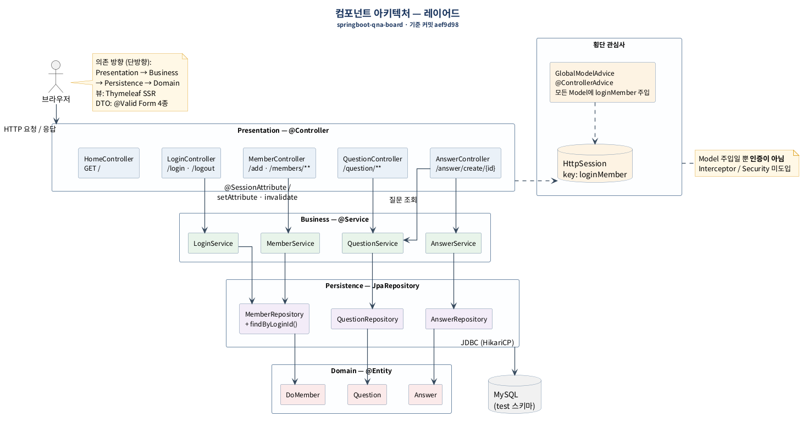
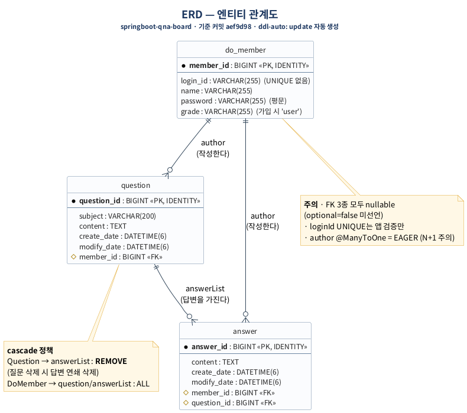

# springboot-qna-board

**Spring Boot 기반 Q&A 게시판 — 회원·인증·게시판·검색·권한을 밑바닥부터 구현**


<!-- IMG: 대표스크린샷(질문목록+검색).png | 질문 목록 · 검색 · 페이징 -->

---

## 📌 3줄 요약

- **What** — 회원가입·세션 인증부터 질문/답변 CRUD, 검색, 페이징, 관리자 노출 제어까지 갖춘 서버사이드 렌더링 Q&A 게시판.
- **Why** — KDT 과정에서 프레임워크의 "마법"에 기대지 않고, 인증과 CRUD가 실제로 어떻게 동작하는지 원리를 직접 구현하며 학습하기 위해 만들었습니다.
- **How** — 레이어드 아키텍처(Controller · Service · Repository)와 Thymeleaf 서버사이드 렌더링으로 구성했고, 커밋은 기능 단위의 원자 커밋으로 관리했습니다.

---

## 🧭 목차

1. [핵심 기능](#-핵심-기능)
2. [아키텍처](#-아키텍처)
3. [기술적 의사결정](#-기술적-의사결정)
4. [트러블슈팅](#-트러블슈팅)
5. [실행 방법](#-실행-방법)
6. [알려진 한계와 개선 계획](#-알려진-한계와-개선-계획)
7. [문서 & 커밋 컨벤션](#-문서--커밋-컨벤션)

---

## 🧩 핵심 기능

| 기능 | 설명 | 관련 코드 |
|---|---|---|
| 회원가입 / 로그인 | 세션 기반 인증, 중복 검증 | [`MemberController`](src/main/java/com/example/login/controller/MemberController.java) · [`LoginController`](src/main/java/com/example/login/controller/LoginController.java) |
| 질문 CRUD | 질문 등록·조회·수정·삭제, 목록/상세 뷰 | [`QuestionController`](src/main/java/com/example/login/controller/QuestionController.java) |
| 답변 CRUD | 질문에 종속된 답변 등록·수정·삭제 | [`AnswerController`](src/main/java/com/example/login/controller/AnswerController.java) |
| 수정 (폼 재사용) | 등록 폼을 재사용해 수정 처리 (단일 템플릿) | [`questionForm.html`](src/main/resources/templates/user/questionForm.html) |
| 삭제 (모달 + cascade) | 확인 모달 후 삭제, 연관 답변 cascade 정리 | [`Question`](src/main/java/com/example/login/domain/Question.java) |
| 검색 | Specification 기반 5개 필드 OR 검색 | [`QuestionService`](src/main/java/com/example/login/service/QuestionService.java) |
| 페이징 | 검색어를 유지한 페이지 이동 | [`questionList.html`](src/main/resources/templates/user/questionList.html) |
| 관리자 노출 제어 | 회원 등급(grade)에 따른 UI 노출 분기 | [`home.html`](src/main/resources/templates/home.html) |
| 에러 페이지 | 4xx/5xx 커스텀 에러 화면 | [`templates/error`](src/main/resources/templates/error) |

<!-- IMG: 질문목록_검색_페이징.png | 검색어 유지 페이징 -->
<!-- IMG: 질문상세_답변.png | 질문 상세 · 답변 등록 -->
<!-- IMG: 등록수정폼.png | 등록/수정 공용 폼 -->
<!-- IMG: 삭제모달.png | 삭제 확인 모달 -->

---

## 🏗 아키텍처



요청은 `Controller → Service → Repository → DB`로 **단방향 의존**만 흐르도록 구성했습니다. 도메인 로직은 Service에 모으고, Controller는 요청/응답 변환과 뷰 바인딩만 담당합니다. 인증은 세션 기반으로 처리하며, 로그인 여부·권한 같은 **횡단 관심사**는 컨트롤러 로직과 분리해 다뤘습니다. 뷰는 Thymeleaf 서버사이드 렌더링으로, 프래그먼트를 재사용해 화면 간 중복을 줄였습니다.



> 세부 흐름을 담은 시퀀스 다이어그램 4종(로그인, 질문 등록, 질문 상세, 답변 등록)은 [`docs/design/images/`](docs/design/images)에서 확인할 수 있습니다. 설계 문서는 게시판 1차 구현(`aef9d98`) 시점 기준이며, 이후 추가된 수정·삭제·검색 기능은 아래 섹션에 반영되어 있습니다.

---

## 🧠 기술적 의사결정

### 1. 검색 구현 — `@Query` 문자열 vs Specification
- **상황** — 제목·내용·질문 작성자·답변 내용·답변 작성자 5개 필드를 OR로 묶어 검색하되 페이징과 함께 동작해야 했습니다.
- **선택지** — JPQL `@Query` 문자열로 조건을 직접 작성하는 방법과, `Specification`으로 조건을 조립하는 방법이 있었습니다.
- **선택과 이유** — 문자열 쿼리는 조건이 늘어날수록 유지보수가 어렵고 페이징과의 결합도 번거로웠습니다. 동적 조건 확장성과 `Pageable`과의 자연스러운 결합을 위해 `Specification`을 선택했습니다.

### 2. 삭제 정합성 — 앱 레벨 반복 삭제 vs cascade REMOVE
- **상황** — 질문을 삭제하면 딸린 답변도 함께 사라져야 했습니다.
- **선택지** — 서비스 코드에서 답변을 먼저 조회·삭제한 뒤 질문을 삭제하는 방식과, JPA 연관관계의 cascade에 위임하는 방식이 있었습니다.
- **선택과 이유** — 삭제 정합성 책임을 애플리케이션 코드에 분산시키기보다 연관관계에 위임하는 편이 실수 여지가 적다고 판단해 cascade REMOVE를 사용했고, 실제 삭제 순서(답변 → 질문)는 SQL 로그로 검증했습니다.

### 3. 등록/수정 폼 — 템플릿 2벌 vs `th:action` 재사용
- **상황** — 등록 폼과 수정 폼의 필드 구성이 사실상 동일했습니다.
- **선택지** — 등록용·수정용 템플릿을 따로 두는 방법과, 값을 비운 `th:action`으로 하나의 템플릿을 재사용하는 방법이 있었습니다.
- **선택과 이유** — 폼을 두 벌 관리하면 필드 변경 시 양쪽을 모두 고쳐야 합니다. 값이 없는 `th:action`이 **현재 URL로 POST**한다는 원리를 이용해 단일 템플릿으로 등록·수정을 모두 처리했습니다.

### 4. 시크릿 관리 — yaml 평문 vs 환경변수 참조
- **상황** — 초기에 DB 비밀번호를 `application.yaml`에 평문으로 두었습니다.
- **선택지** — 평문을 유지하는 방법과, 환경변수 참조로 분리하는 방법이 있었습니다.
- **선택과 이유** — 설정 파일에 자격 증명이 남으면 커밋 이력에 노출될 위험이 있어, 값을 환경변수 참조(`${DB_PASSWORD}`)로 바꾸고 예시 파일만 커밋했습니다. 이미 노출된 비밀번호는 **실제로 변경**해 이력을 무효화했습니다.

---

## 🔧 트러블슈팅

### 1. 반복문 안의 모달이 첫 번째 항목만 열림
- **문제** — 답변마다 삭제 모달을 두었는데, 어떤 답변의 버튼을 눌러도 항상 첫 번째 모달만 열렸습니다.
- **과정** — 반복 렌더링된 모달들이 모두 같은 HTML `id`를 갖고 있었고, 버튼의 트리거도 같은 `id`를 가리키고 있음을 확인했습니다. HTML `id`는 문서 내 유일해야 한다는 점이 원인이었습니다.
- **해결** — `th:id`로 답변 식별자를 붙여 모달 `id`를 동적으로 생성하고(`answerDeleteModal${answer.id}`), 트리거도 같은 규칙으로 연결했습니다.
- **결과** — 각 답변이 자신의 독립 모달을 열도록 동작하게 되었습니다.

### 2. 템플릿 500 에러 — "property on null"
- **문제** — 질문 상세 화면 렌더링 시 `null`에 대한 프로퍼티 접근으로 500 에러가 발생했습니다.
- **과정** — 스택 트레이스를 따라가 보니, `th:each`에서 선언한 반복 변수를 반복 블록 **바깥**에서 참조하고 있었습니다. 변수 수명 밖 접근이라 값이 `null`이었습니다.
- **해결** — 해당 참조를 반복문 내부로 옮겨 변수 스코프 안에서만 사용하도록 수정했습니다.
- **결과** — 에러가 사라졌고, Thymeleaf 반복 변수의 스코프에 대한 이해를 정리했습니다.

### 3. DB 비밀번호가 커밋 이력에 노출됨
- **문제** — 설정 파일에 평문으로 둔 DB 비밀번호가 이미 커밋 이력에 남아 있었습니다.
- **과정** — history rewrite로 이력에서 지우는 방법과, 비밀번호를 실제로 바꿔 노출된 값을 무력화하는 방법을 비교했습니다. rewrite는 이력을 흔들 수 있고, 이미 노출된 값 자체는 여전히 유효하다는 한계가 있었습니다.
- **해결** — 비밀번호를 실제로 변경해 노출된 값을 무효화하고, 설정은 환경변수 참조로 바꿔 예시 파일만 커밋했습니다. 비밀번호 변경 **완료 전에는 push하지 않는 순서**를 지켰습니다.
- **결과** — 유효한 자격 증명이 저장소에 남지 않게 되어 안전하게 push할 수 있었습니다.

---

## ▶ 실행 방법

```bash
# 1. 클론
git clone https://github.com/yoorobo/springboot-qna-board.git
cd springboot-qna-board

# 2. 설정 파일 준비
cp src/main/resources/application.yaml.example src/main/resources/application.yaml
```

3. **환경변수 설정** — DB 접속 비밀번호는 환경변수로 주입합니다. IntelliJ 기준 **Run/Debug Configurations → Environment variables**에 다음을 추가합니다.

```
DB_PASSWORD=your_password
```

4. **기동** — `LoginApplication`을 실행하면 `localhost:8080`에서 접속할 수 있습니다.

> **관리자 계정** — 가입 화면에는 등급 선택이 없어, 관리자 기능은 DB에서 해당 계정의 `grade`를 `admin`으로 직접 승격해야 활성화됩니다.

---

## ⚠ 알려진 한계와 개선 계획

- **[1순위] 수정/삭제 서버측 권한 검증 부재** — 현재 작성자 확인이 뷰 레벨(버튼 노출)에서만 이뤄집니다. 요청을 직접 보내면 우회 가능하므로, 인터셉터로 서버측 권한 검증을 추가할 예정입니다.
- **비밀번호 평문 저장** — 회원 비밀번호가 평문으로 저장됩니다. 단방향 해시(BCrypt) 적용으로 개선할 계획입니다.
- **`loginId` UNIQUE 제약 부재** — 아이디 중복을 애플리케이션 검증에만 의존합니다. DB에 UNIQUE 제약을 추가해 정합성을 보강할 예정입니다.
- **N+1 (EAGER)** — 일부 연관관계가 EAGER 로딩이라 조회 시 추가 쿼리가 발생합니다. LAZY 전환과 fetch join으로 개선할 계획입니다.

---

## 📎 문서 & 커밋 컨벤션

- 설계 문서(컴포넌트 아키텍처, ERD, 인터페이스 명세, 시퀀스 다이어그램)는 [`docs/design/`](docs/design)에 있습니다.
- 커밋은 `feat` / `fix` / `docs` / `chore` 접두어로 구분한 **기능 단위 원자 커밋**으로 관리했습니다.
