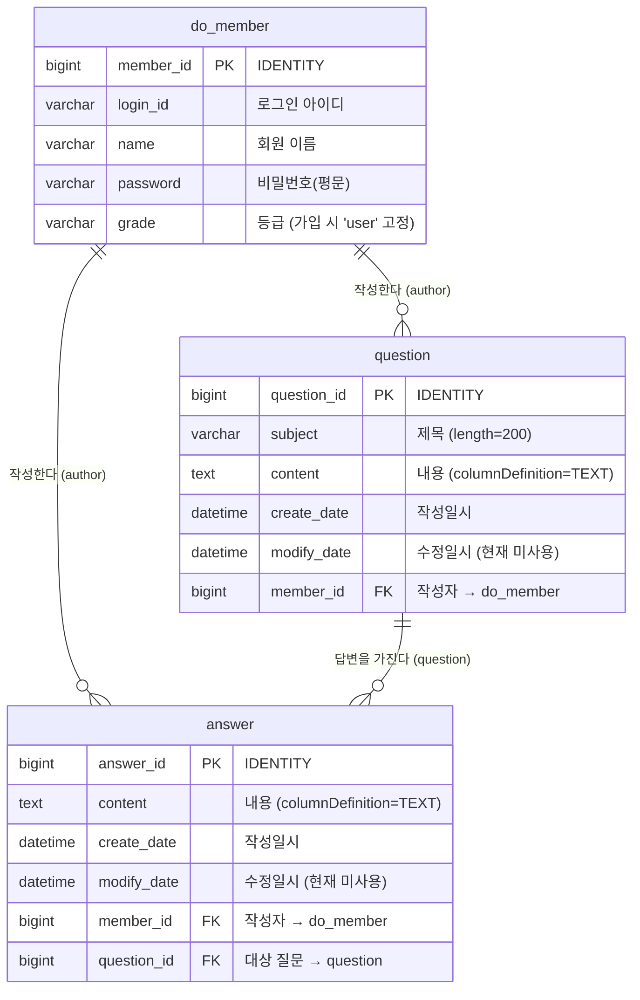
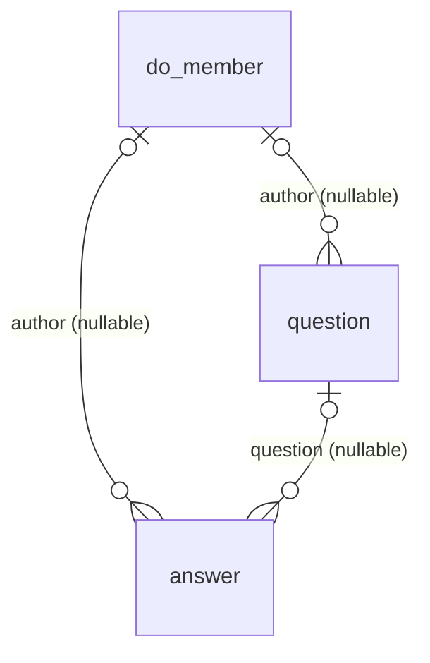

# ERD — 엔티티 관계 다이어그램

> ⚠️ **현행 코드와 일부 불일치** — 해당 설계 문서는 Spring Security 및 OAuth2 도입 전 코드(기준 커밋 `aef9d98`) 기준이며, 현재 인증 구조와 일부 불일치합니다. 현행 인증·소셜 로그인 흐름은 [`../../README.md`](../../README.md)와 [`../oauth-login-flow.md`](../oauth-login-flow.md)를 참고하세요.

- 기준 커밋: `aef9d98`
- 근거: `src/main/java/com/example/login/domain/` 의 `DoMember.java`, `Question.java`, `Answer.java`
- 스키마는 JPA `ddl-auto: update`로 자동 생성됩니다. 별도의 DDL 스크립트나 `@Table(name=...)` 지정은 **없습니다** — 테이블/컬럼명은 Hibernate 기본 네이밍 전략(camelCase → snake_case)으로 산출한 값입니다.

---

## 1. 다이어그램

### ⚠️ 카디널리티 각주 — FK 필수 여부는 **미확정**

`domain` 패키지 전체에 `optional = false` / `nullable = false` 선언이 **하나도 없습니다**(STEP 0-A grep 결과: 검출 0건).
따라서 **DB 레벨에서 세 FK(`question.member_id`, `answer.member_id`, `answer.question_id`)는 모두 NULL 허용**이며, 엄밀한 표기는 `|o--o{`(0..1 : 0..N)입니다.

위 다이어그램은 **애플리케이션 코드가 실제로 지키는 불변식**을 기준으로 `||--o{`(1 : 0..N)로 그렸습니다. 근거는 다음과 같습니다.

- `QuestionController.questionCreate()` — `@SessionAttribute(..., required=true)`로 받은 `loginMember`를 `question.setAuthor()`에 항상 세팅
- `AnswerService.create()` — `setQuestion()`, `setAuthor()`를 항상 세팅

다만 이는 **코드 컨벤션일 뿐 스키마 제약이 아닙니다**. 특히 `AnswerController`의 `loginMember`는 `required = false`라, 미로그인 상태로 답변을 POST하면 **`author`가 NULL인 answer 행이 실제로 생성될 수 있습니다** (템플릿도 `question.author != null`을 방어적으로 검사 중). 스키마상 실제 카디널리티는 아래와 같습니다.

→ 필수 여부를 확정하려면 `@ManyToOne(optional = false)` 또는 `@JoinColumn(nullable = false)` 명시가 필요합니다. **[TBD: 미구현]** — JUDGMENT_LOG `[B]-1` 참조.

---

## 2. 테이블 상세

### 2.1 `do_member` (엔티티 `DoMember`)

| 컬럼 | 타입 | 제약 | 소스 근거 |
|---|---|---|---|
| `member_id` | BIGINT | PK, `@GeneratedValue(IDENTITY)` | `@Column(name = "member_id")` |
| `login_id` | VARCHAR(255) | — (UNIQUE 제약 **없음**) | `private String loginId;` |
| `name` | VARCHAR(255) | — | `private String name;` |
| `password` | VARCHAR(255) | — | `private String password;` |
| `grade` | VARCHAR(255) | — | `private String grade;` |

> **UNIQUE 부재 주의**: `loginId` 중복은 DB 제약이 아니라 `MemberService.validateDuplicateMember()`의 애플리케이션 검사로만 막습니다(중복 시 `IllegalStateException`). 동시 요청 시 중복 가입이 발생할 수 있습니다.

**연관관계 (소유하지 않는 쪽, `mappedBy`)**

| 필드 | 매핑 | cascade |
|---|---|---|
| `List<Question> questionList` | `@OneToMany(mappedBy = "author")` | `CascadeType.ALL` |
| `List<Answer> answerList` | `@OneToMany(mappedBy = "author")` | `CascadeType.ALL` |

### 2.2 `question` (엔티티 `Question`)

| 컬럼 | 타입 | 제약 | 소스 근거 |
|---|---|---|---|
| `question_id` | BIGINT | PK, IDENTITY | `@Column(name="question_id")` |
| `subject` | VARCHAR(200) | — | `@Column(length = 200)` |
| `content` | TEXT | — | `@Column(columnDefinition = "TEXT")` |
| `create_date` | DATETIME(6) | — | `LocalDateTime createDate` |
| `modify_date` | DATETIME(6) | — | `LocalDateTime modifyDate` (현재 세팅하는 코드 없음) |
| `member_id` | BIGINT | FK → `do_member.member_id` | `@ManyToOne @JoinColumn(name = "member_id")` |

**연관관계**

| 필드 | 매핑 | fetch | cascade |
|---|---|---|---|
| `DoMember author` | `@ManyToOne @JoinColumn(name="member_id")` | **EAGER** (기본값) | 없음 |
| `List<Answer> answerList` | `@OneToMany(mappedBy = "question")` | **LAZY** (기본값) | `CascadeType.REMOVE` |

### 2.3 `answer` (엔티티 `Answer`)

| 컬럼 | 타입 | 제약 | 소스 근거 |
|---|---|---|---|
| `answer_id` | BIGINT | PK, IDENTITY | `@Column(name="answer_id")` |
| `content` | TEXT | — | `@Column(columnDefinition = "TEXT")` |
| `create_date` | DATETIME(6) | — | `LocalDateTime createDate` |
| `modify_date` | DATETIME(6) | — | `LocalDateTime modifyDate` (현재 세팅하는 코드 없음) |
| `member_id` | BIGINT | FK → `do_member.member_id` | `@ManyToOne @JoinColumn(name="member_id")` |
| `question_id` | BIGINT | FK → `question.question_id` | `@ManyToOne @JoinColumn(name = "question_id")` |

**연관관계**

| 필드 | 매핑 | fetch |
|---|---|---|
| `DoMember author` | `@ManyToOne @JoinColumn(name="member_id")` | **EAGER** (기본값) |
| `Question question` | `@ManyToOne @JoinColumn(name="question_id")` | **EAGER** (기본값) |

---

## 3. Cascade 정책 요약

| 소유 엔티티 | 대상 | cascade | 의미 |
|---|---|---|---|
| `DoMember` | `questionList` | `ALL` | 회원 영속화/삭제가 질문에 전파 (PERSIST·MERGE·REMOVE·REFRESH·DETACH 전부) |
| `DoMember` | `answerList` | `ALL` | 회원 영속화/삭제가 답변에 전파 |
| `Question` | `answerList` | `REMOVE` | 질문 삭제 시 해당 질문의 답변도 함께 삭제 |

> **`orphanRemoval`은 어디에도 지정되어 있지 않습니다**(기본값 `false`). 컬렉션에서 원소만 제거해도 DB 행은 삭제되지 않습니다.

### ⚠️ `MemberService.delete()`와 cascade의 상호작용

`MemberService.delete(memberId)`는 `memberRepository.deleteById()`를 호출합니다. `DoMember`의 두 `@OneToMany`가 `cascade = ALL`(REMOVE 포함)이므로, **회원을 삭제하면 그 회원이 쓴 질문·답변이 함께 삭제되고**, 질문 삭제는 다시 `Question → answerList`의 `REMOVE`로 전파됩니다.

다만 `deleteById`가 실제로 cascade를 태우려면 엔티티를 먼저 로딩해야 하며, 그 과정에서 다른 회원이 해당 질문에 단 답변까지 연쇄 삭제될 수 있습니다. 이 동작은 **런타임으로 검증하지 않았습니다** — JUDGMENT_LOG `[B]-2` 참조.

---

## 4. 조회 흐름 상 주의점 (N+1)

- `Question.author`, `Answer.author`, `Answer.question`이 모두 **EAGER**입니다.
- `QuestionService.getList()`(= `findAll()`)는 질문 N건을 조회한 뒤 각 질문의 `author`를 채우기 위해 추가 쿼리를 발생시킬 수 있습니다(전형적 N+1).
- 페치 조인이나 `@BatchSize`는 **[TBD: 미구현]**입니다.
