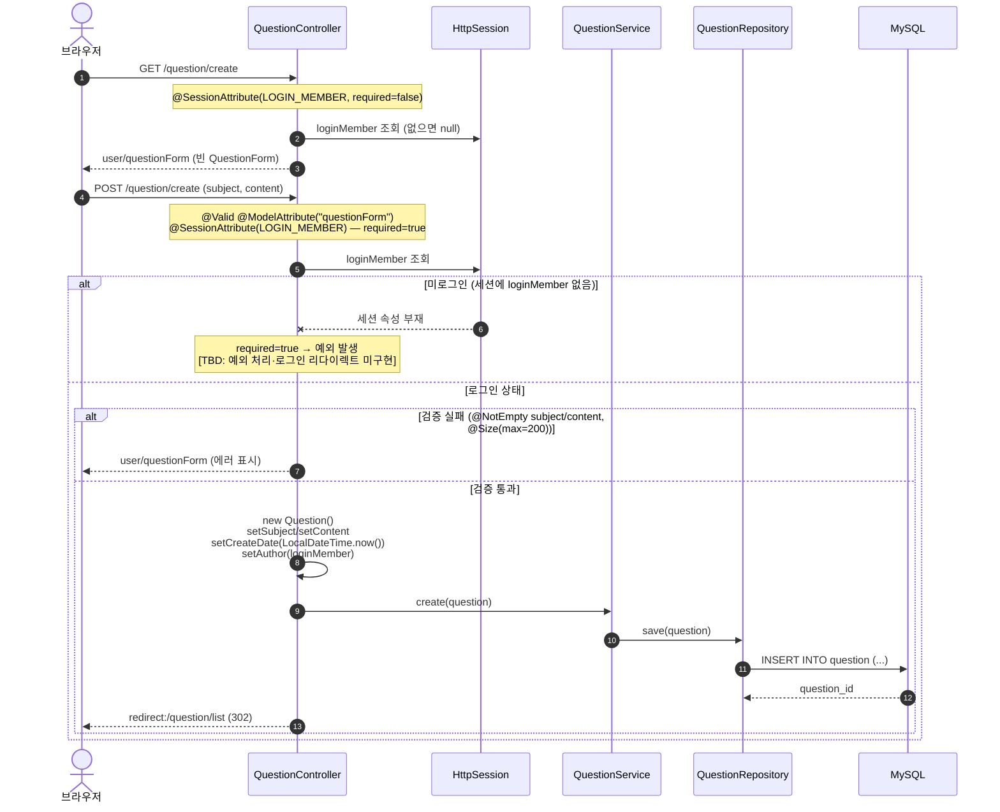

# 시퀀스 다이어그램

- 기준 커밋: `aef9d98`
- participant는 모두 **실제 클래스명**입니다. `@SessionAttribute`는 **해당 핸들러 시그니처에 실제로 존재하는 경우에만** 표기했습니다.
- 공통 사항: `GlobalModelAdvice`(`@ControllerAdvice`)가 **모든 요청**의 Model에 `loginMember`를 주입하지만, 다이어그램 가독성을 위해 흐름 1에만 명시하고 나머지는 생략했습니다.

---

## 1. 로그인 (`POST /login`)

근거: `LoginController.login()`, `LoginService.login()`, `MemberRepository.findByLoginId()`

```mermaid
sequenceDiagram
    autonumber
    actor Browser as 브라우저
    participant LoginController
    participant GlobalModelAdvice
    participant LoginService
    participant MemberRepository
    participant HttpSession
    participant DB as MySQL

    Browser->>LoginController: GET /login
    LoginController-->>Browser: user/loginForm (빈 LoginForm)

    Browser->>LoginController: POST /login (loginId, password)
    Note over LoginController: @Valid @ModelAttribute("loginForm")<br/>+ BindingResult
    LoginController->>GlobalModelAdvice: (요청마다 loginMember 모델 주입)

    alt 필드 검증 실패 (@NotEmpty)
        LoginController-->>Browser: user/loginForm (에러 표시)
    else 검증 통과
        LoginController->>LoginService: login(loginId, password)
        LoginService->>MemberRepository: findByLoginId(loginId)
        MemberRepository->>DB: SELECT ... WHERE login_id = ?
        DB-->>MemberRepository: row / empty
        MemberRepository-->>LoginService: Optional&lt;DoMember&gt;

        alt 아이디 없음 or 비밀번호 불일치
            Note over LoginService: 평문 equals() 비교
            LoginService-->>LoginController: null
            LoginController->>LoginController: bindingResult.reject("loginFail")
            LoginController-->>Browser: user/loginForm ("아이디 또는 비밀번호가 맞지 않습니다")
        else 로그인 성공
            LoginService-->>LoginController: DoMember
            LoginController->>HttpSession: request.getSession() (없으면 신규 생성)
            LoginController->>HttpSession: setAttribute(SessionConst.LOGIN_MEMBER, loginMember)
            Note over LoginController: log.info 로 세션·회원 출력
            LoginController-->>Browser: redirect:/ (302)
        end
    end
```

**로그아웃 (`POST /logout`)** — `request.getSession(false)`로 기존 세션만 조회하고(없으면 생성하지 않음), 있으면 `session.invalidate()` 후 `redirect:/`.

---

## 2. 질문 등록 (`GET → POST /question/create`)

근거: `QuestionController.questionCreateForm()`, `questionCreate()`, `QuestionService.create()`



> `modifyDate`는 이 흐름에서 **세팅되지 않습니다** (질문 수정 기능이 `[TBD: 미구현]`이므로 항상 NULL).

---

## 3. 질문 상세 + 답변 목록 (`GET /question/detail/{id}`)

근거: `QuestionController.detail()`, `QuestionService.getQuestion()`, `templates/user/questionDetail.html`

```mermaid
sequenceDiagram
    autonumber
    actor Browser as 브라우저
    participant QuestionController
    participant HttpSession
    participant QuestionService
    participant QuestionRepository
    participant Question as Question(엔티티)
    participant Thymeleaf as Thymeleaf(questionDetail)
    participant DB as MySQL

    Browser->>QuestionController: GET /question/detail/{id}
    Note over QuestionController: @PathVariable("id") Long id<br/>@SessionAttribute(LOGIN_MEMBER, required=false)
    QuestionController->>HttpSession: loginMember 조회 (없으면 null)

    QuestionController->>QuestionService: getQuestion(id)
    QuestionService->>QuestionRepository: findById(id)
    QuestionRepository->>DB: SELECT * FROM question WHERE question_id = ?
    Note over DB: author는 @ManyToOne EAGER →<br/>do_member 즉시 로딩 (조인 또는 추가 SELECT)
    DB-->>QuestionRepository: question row (+ author)
    QuestionRepository-->>QuestionService: Optional&lt;Question&gt;
    QuestionService-->>QuestionController: Optional&lt;Question&gt;
    Note over QuestionController: .orElseThrow()<br/>없는 id → NoSuchElementException (500)<br/>[TBD: 404 처리 미구현]

    QuestionController->>QuestionController: model: question, new AnswerForm(), loginMember
    QuestionController-->>Thymeleaf: return "user/questionDetail"

    rect rgb(240, 240, 240)
        Note over Thymeleaf,DB: 렌더링 중 LAZY 컬렉션 초기화 (OSIV)
        Thymeleaf->>Question: ${question.answerList} 접근<br/>(#lists.size + th:each)
        Note over Question: @OneToMany(mappedBy="question") → 기본 LAZY<br/>영속성 컨텍스트가 뷰까지 열려 있음<br/>(spring.jpa.open-in-view 기본값 true, yaml에 별도 설정 없음)
        Question->>DB: SELECT * FROM answer WHERE question_id = ?
        Note over DB: 각 answer의 author·question도 EAGER
        DB-->>Question: answer rows
        Question-->>Thymeleaf: List&lt;Answer&gt;
    end

    Thymeleaf-->>Browser: HTML (질문 본문 + 답변 N건 + 답변 등록 폼)
```

**LAZY/OSIV 각주**: `Question.answerList`는 `@OneToMany`라 fetch 기본값이 **LAZY**입니다. 컨트롤러·서비스에서는 초기화하지 않고, **템플릿 렌더링 시점에 `question.answerList`를 접근**하면서 초기화됩니다. 이것이 `LazyInitializationException` 없이 동작하는 이유는 Spring Boot의 **OSIV(`spring.jpa.open-in-view`)가 기본 활성(true)**이고 `application.yaml`에 이를 끄는 설정이 없기 때문입니다. OSIV를 끄면 이 화면은 깨지며, 서비스 계층에서 페치 조인 등으로 초기화해야 합니다 — JUDGMENT_LOG `[B]-3` 참조.

---

## 4. 답변 등록 (`POST /answer/create/{questionId}`)

근거: `AnswerController.createAnswer()`, `AnswerService.create()`

```mermaid
sequenceDiagram
    autonumber
    actor Browser as 브라우저
    participant AnswerController
    participant HttpSession
    participant QuestionService
    participant AnswerService
    participant AnswerRepository
    participant DB as MySQL

    Browser->>AnswerController: POST /answer/create/{questionId} (content)
    Note over AnswerController: @PathVariable("questionId")<br/>@Valid @ModelAttribute("answerForm")<br/>@SessionAttribute(LOGIN_MEMBER, required=false)
    AnswerController->>HttpSession: loginMember 조회 (없으면 null)

    AnswerController->>QuestionService: getQuestion(questionId)
    QuestionService-->>AnswerController: Optional&lt;Question&gt; → .orElseThrow()
    Note over AnswerController: 검증 성공·실패 여부와 무관하게<br/>질문을 먼저 조회 (화면 재표시용)

    alt 검증 실패 (@NotEmpty content — 빈 답변)
        AnswerController->>AnswerController: model: question, loginMember
        AnswerController-->>Browser: user/questionDetail (redirect 아님, 상세 재렌더링 + 에러)
    else 검증 통과
        AnswerController->>AnswerService: create(question, content, loginMember)
        AnswerService->>AnswerService: new Answer()<br/>setContent / setCreateDate(now())<br/>setQuestion(question) / setAuthor(loginMember)
        AnswerService->>AnswerRepository: save(answer)
        AnswerRepository->>DB: INSERT INTO answer (content, create_date, member_id, question_id)
        DB-->>AnswerRepository: answer_id
        AnswerController-->>Browser: redirect:/question/detail/{questionId} (302)
    end
```

> ⚠️ **미로그인 답변 가능**: `loginMember`가 `required = false`라, 세션이 없어도 핸들러가 정상 실행되어 `author = null`인 답변이 저장됩니다(`AnswerService.create()`에 null 검사 없음). `POST /question/create`가 `required = true`인 것과 대조적입니다 — JUDGMENT_LOG `[A]-2` 참조.
