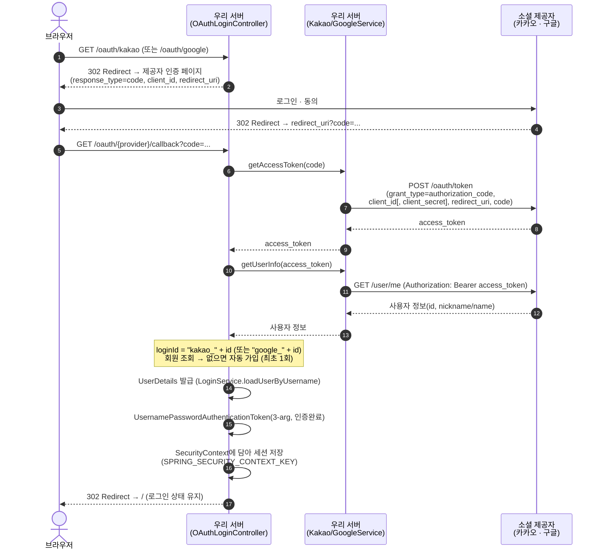

# OAuth2 소셜 로그인 흐름 (카카오 · 구글)

- 기준 커밋: `cc98f78`
- 근거: `KakaoLoginController` · `GoogleLoginController` · `KakaoService` · `GoogleService` · `LoginService`
- 카카오와 구글은 세부 파라미터(구글은 `client_secret`·`scope` 필수, 응답 구조 차이)만 다르고 **인가코드 → 토큰 → 사용자정보 → 회원연동 → SecurityContext 저장**의 큰 흐름은 동일합니다.

아래 시퀀스 다이어그램은 [README](../README.md#-소셜-로그인-oauth2)에 첨부한 이미지([`docs/images/oauth-login-flow.png`](images/oauth-login-flow.png))와 동일한 흐름을 GitHub 네이티브 렌더로 표현한 편집 가능 원본입니다.

## 카카오와 구글의 차이

| 항목 | 카카오 | 구글 |
|---|---|---|
| 토큰 교환 시 `client_secret` | 없음 | **필수** (`GOOGLE_CLIENT_SECRET`) |
| 인증 요청 `scope` | 미지정 | `email profile` **필수** |
| 사용자 식별자(`id`) 타입 | JSON 숫자 → `(Number)`로 수신 후 `long` 변환 | 이미 문자열 |
| 사용자 정보 구조 | `kakao_account.profile.nickname` (중첩) | `name` (평평) |

> 사용자 식별자를 `(Number)`로 받는 것은 JSON 정수가 파서에 따라 `Integer`/`Long`으로 달라질 수 있어, 두 경우 모두 안전하게 `long`으로 변환하기 위한 방어입니다. 닉네임은 Deprecated된 `properties.nickname` 대신 공식 표준 경로 `kakao_account.profile.nickname`을 사용합니다.
